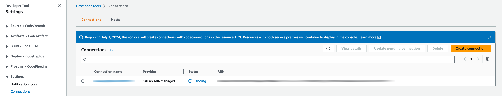
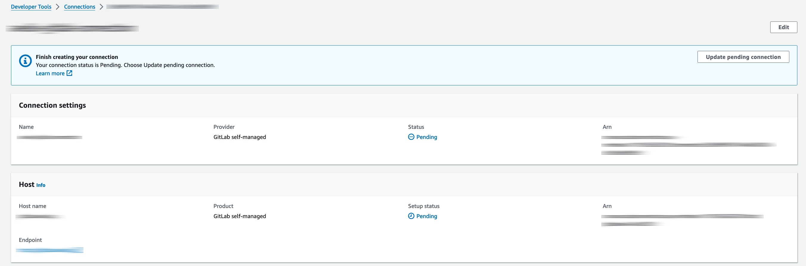
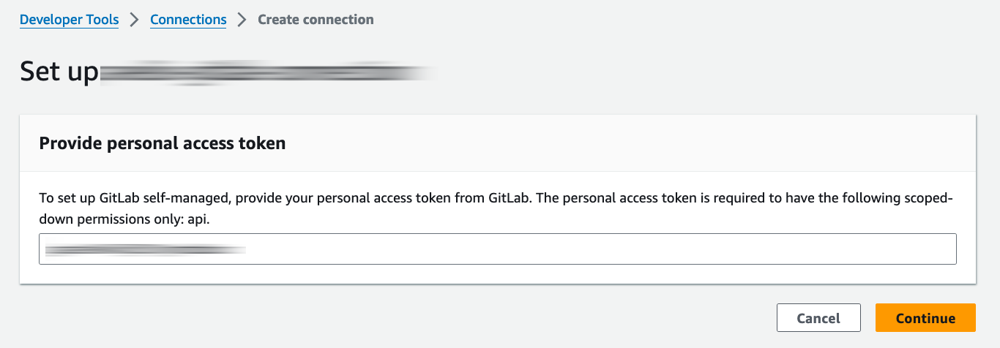
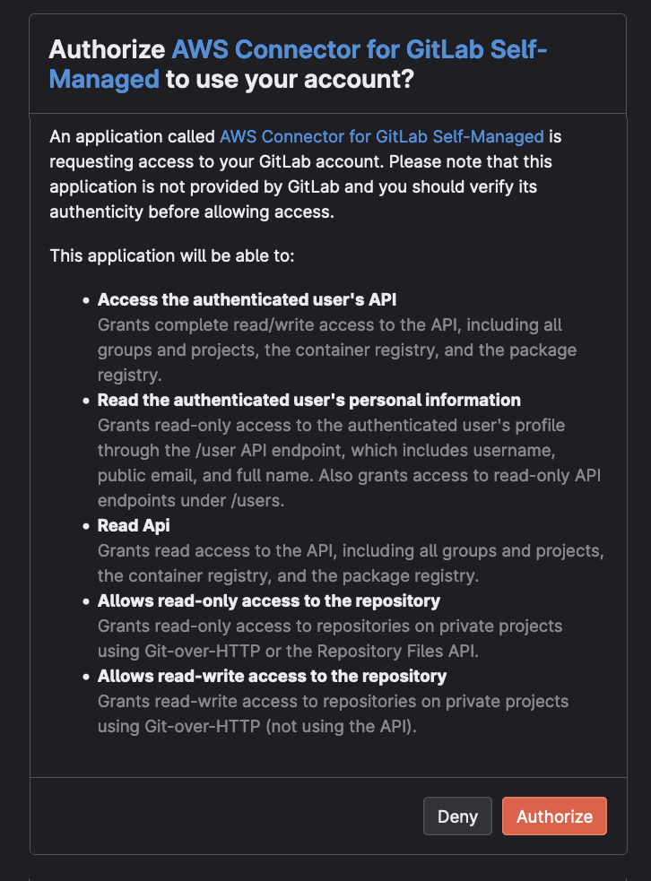
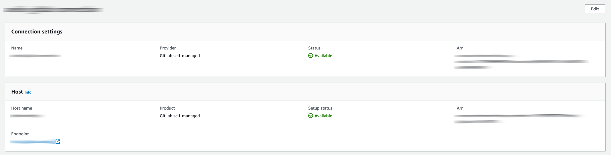

# AWS CodeConnections Host Custom Resource

This AWS CDK Construct provides a custom resource (Lambda Function) to create a connection host for Self-Managed GitLab, which is not yet supported by CloudFormation. Additionally, even after creating the Host and the connection, authentication must be done via a browser.

## Install

### TypeScript

#### install by npm

```shell
npm install @gammarers/aws-codeconnections-host-custom-resource
```

#### install by yarn

```shell
yarn add @gammarers/aws-codeconnections-host-custom-resource
```

## Example

```typescript
import { RDSDatabaseAutoRunningStopStack } from '@gammarers/aws-codeconnections-host-custom-resource';

const codeConnectionsHostCustomResource = new CodeConnectionsHostCustomResource(this, 'CodeConnectionsHost', {
  name: 'gitlab.example.com', // required, connection host name (Minimum length of 1. Maximum length of 64.)
  providerEndpoint: 'https://gitlab.example.com', // required, your provider endpoint (Minimum length of 1. Maximum length of 512.)
  providerType: 'GitLabSelfManaged', // required, Bitbucket | GitHub | GitHubEnterpriseServer | GitLab | GitLabSelfManaged
});

// get host arn
const hostArn = codeConnectionsHostCustomResource.getResponseField('HostArn');

new codeconnections.CfnConnection(this, 'Connection', {
  connectionName: 'example-gitlab-connection',
  hostArn,
});

```

## How to complete (Update a pending connection)

Deploy completed after being configured in EXAMPLE.
At this point, the status is ‘Pending’ as shown below because authentication has not yet been completed.



Select the ‘Connection’ you have created to display the Connection detail screen.



You will see the ‘Pending’ status as follows. Select ‘Update pending connection’.



A screen to enter the Provide personal access token (pat) will be displayed; the pat should be created in the target host environment (only api should be enabled). Enter the pat and select ‘Continue’.



The host authorisation screen will appear as shown below, select ‘Authorise’ (the screen will pop up).
> If you have not logged in, a login screen will be displayed, please log in.



When completed, the status will change to ‘Available’ as follows. This completes all Connection settings.


## License

This project is licensed under the Apache-2.0 License.
